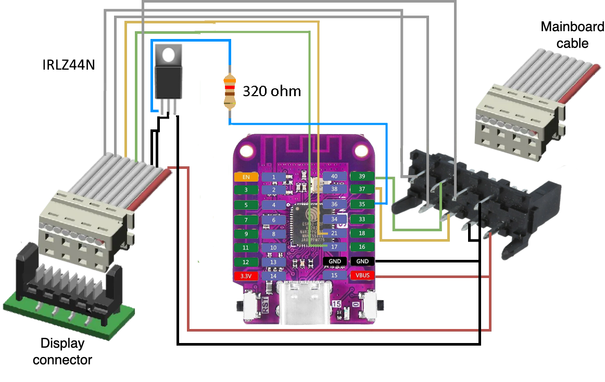

# ESPHome Smart Coffee (Philips Series 3200)

This project integrates a Philips Series 3200 Coffee Machine into [Home Assistant](https://home-assistant.io) through [ESPHome](https://esphome.io). It is a fork of TillFleich's repo for the 2200 Series.
This component has been developed on a Philips EP3243 and an ESP32 S2 Mini.

This component provides a `Power Switch`, a `Status sensor` and various `Buttons` which simulate user input.
The `Power Switch` can be used to turn on the coffee machine with and without a cleaning cycle during startup.

You might break/brick your coffee machine by modifying it in any way, shape or form. If you want to use this component, do so at your own risk.

# Configuration variables

A example configuration can be found [here](example.yaml)

## Philips Series 3200

- **id**(**Required**, string):Controller ID which will be used for entity configuration.
- **display_uart**(**Required**, string): ID of the UART-Component connected to the display unit
- **mainboard_uart**(**Required**, string): ID of the UART-Component connected to the mainboard
- **power_pin**(**Required**, [Pin](https://esphome.io/guides/configuration-types.html#config-pin)): Pin to which the MOSFET/Transistor is connected. This pin is used to temporarily turn of the display unit.
- **invert_power_pin**(**Optional**: boolean): If set to true the output of the power pin will be inverted. Defaults to `false`.
- **power_trip_delay**(**Optional**: Time): Determines the length of the power outage applied to the display unit, which is to trick it into turning on. Defaults to `500ms`.

## Philips Power switch

- **controller_id**(**Required**, string): The Philips Series 3200-Controller to which this entity belongs
- **clean**(**Optional**: boolean): If set to true the machine will perform a cleaning cycle during startup. Otherwise the machine will power on without cleaning. Defaults to `true`.
- All other options from [Switch](https://esphome.io/components/switch/index.html#config-switch)

## Philips Action Button

- **controller_id**(**Required**, string): The Philips Series 3200-Controller to which this entity belongs
- **action**(**Required**, int): The action performed by this button. Select one of `MAKE_COFFEE`, `SELECT_COFFEE`, `SELECT_ESPRESSO`, `MAKE_ESPRESSO`, `SELECT_HOT_WATER`, `MAKE_HOT_WATER`, `SELECT_STEAM`, `MAKE_STEAM`, `SELECT_AMERICANO`, `SELECT_LATTE_MACCHIATO`, `SELECT_CAPPUCCINO`, `MILK`, `BEAN`, `SIZE`, `AQUA_CLEAN`, `CALC_CLEAN`, `PLAY_PAUSE`.
- All other options from [Button](https://esphome.io/components/button/index.html#config-button)

## Philips Status Sensor

- **controller_id**(**Required**, string): The Philips Series 3200-Controller to which this entity belongs
- All other options from [Text Sensor](https://esphome.io/components/text_sensor/index.html#config-text-sensor)
- **use_latte**(**Optional**, boolean): If set to true `Latte Macchiato selected` will be reported instead of `Steam selected`. This option is intended for machines like the EP3243 that can make latte macchiato. Default to `false`.

## Bean Settings

- **controller_id**(**Required**, string): The Philips Series 3200-Controller to which this entity belongs
- **status_sensor_id**(**Required**, string): Id of a status sensor which is also connected to the controller.
- **source**(**Required**, int): The source of this sensor. Select one of `COFFEE`, `ESPRESSO`, `LATTE MACCHIATO`. When selecting `LATTE MACCHIATO` the related status sensor must use `use_latte = true`.
- All other options from [Number](https://esphome.io/components/number/index.html#config-number)

## Size Settings

- **controller_id**(**Required**, string): The Philips Series 3200-Controller to which this entity belongs
- **status_sensor_id**(**Required**, string): Id of a status sensor which is also connected to the controller.
- **source**(**Required**, int): The source of this sensor. Select one of `COFFEE`, `ESPRESSO`, `LATTE MACCHIATO`, `CAPPUCCINO`, `AMERICANO`, `HOT_WATER`. When selecting `LATTE MACCHIATO` the related status sensor must use `use_latte = true`.
- All other options from [Number](https://esphome.io/components/number/index.html#config-number)

## Milk Settings

- **controller_id**(**Required**, string): The Philips Series 3200-Controller to which this entity belongs
- **status_sensor_id**(**Required**, string): Id of a status sensor which is also connected to the controller.
- **source**(**Required**, int): The source of this sensor. Select one of `CAPPUCCINO`, `LATTE MACCHIATO`. When selecting `LATTE MACCHIATO` the related status sensor must use `use_latte = true`.
- All other options from [Number](https://esphome.io/components/number/index.html#config-number)

# Wiring

The coffee machines display unit is connected to the mainboard via a 8-pin ribbon cable with Picoflex connectors.
The display is powered by the mainboard and the two units communicate using a serial bus.
The ESP is placed in between this bus to perform a man-in-the-middle attack.
The RX/TX lines are piped through the ESP such that messages can be read, intercepted and injected.

When injecting a 'turn coffee machine on' command, the coffee machine does turn on, but the display unit does not. To circumvent this behavior we can re-boot the display unit by temporarily removing it's power. Thus the display will power on and operate normally. To perform this operation a transistor or MOSFET can be used.

I got the 8P connector from here: https://www.aliexpress.com/item/1005005142277556.html
And the 8P 'Same direction' from here: https://www.aliexpress.com/item/1005005026658462.html

The following wiring guideline can be used to add a ESP32 S2 Mini to the coffee machine. **The unlabeled wires should be connected without changes.**

# Troubleshooting

- Make sure your wiring is correct
- The UART debug function can be used to analyze communication and verify correct wiring
- The commands used by the display unit may be different between different revisions/models (see Related Work)
